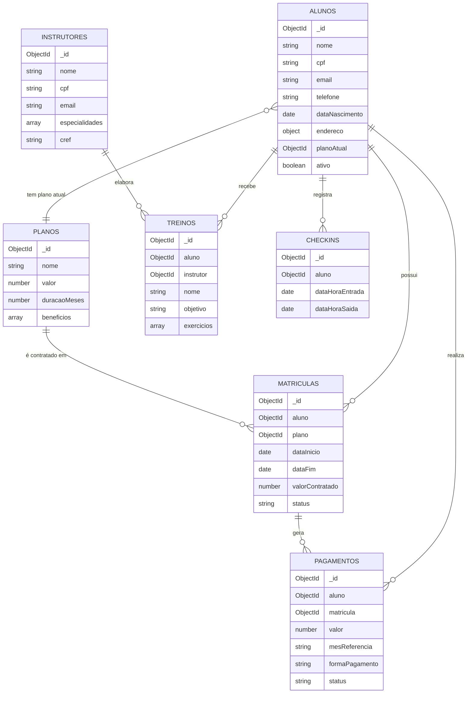

# 🗂️ Modelagem do Banco de Dados — Sistema de Academia (MongoDB / NoSQL)

## 1. Visão geral

O banco `academia_db` é composto por **7 coleções**. Como o MongoDB é orientado a documentos, a modelagem mistura:

- **Referências (`ObjectId` + `ref`)** entre coleções, quando a entidade tem ciclo de vida e consultas próprias (ex.: Aluno, Plano, Instrutor).
- **Subdocumentos embutidos**, quando os dados pertencem exclusivamente ao "dono" do documento e não fazem sentido fora dele (ex.: endereço do aluno, lista de exercícios de um treino).

Essa escolha equilibra performance de leitura (evitando `joins`/populates desnecessários) com flexibilidade de consulta (mantendo entidades importantes pesquisáveis isoladamente).

---

## 2. Coleções

### 2.1 `alunos`
Dados cadastrais do aluno. Tem referência ao plano atual e o endereço é embutido (não precisa existir fora do aluno).

```js
{
  _id: ObjectId,
  nome: String,
  cpf: String (único),
  email: String (único),
  telefone: String,
  dataNascimento: Date,
  endereco: {                  // subdocumento embutido
    rua, numero, bairro, cidade, estado, cep
  },
  planoAtual: ObjectId → planos,
  dataMatricula: Date,
  ativo: Boolean,
  observacoesMedicas: String,
  createdAt: Date,
  updatedAt: Date
}
```

### 2.2 `instrutores`
```js
{
  _id: ObjectId,
  nome: String,
  cpf: String (único),
  email: String (único),
  telefone: String,
  especialidades: [String],
  cref: String,
  ativo: Boolean,
  createdAt, updatedAt
}
```

### 2.3 `planos`
Catálogo de planos da academia.
```js
{
  _id: ObjectId,
  nome: String,                 // Mensal, Trimestral, Anual...
  descricao: String,
  valor: Number,
  duracaoMeses: Number,
  beneficios: [String],
  ativo: Boolean,
  createdAt, updatedAt
}
```

### 2.4 `matriculas`
Representa o vínculo contratual entre aluno e plano em um período específico (permite histórico de renovações).
```js
{
  _id: ObjectId,
  aluno: ObjectId → alunos,
  plano: ObjectId → planos,
  dataInicio: Date,
  dataFim: Date,
  valorContratado: Number,
  status: "ativa" | "vencida" | "cancelada",
  createdAt, updatedAt
}
```

### 2.5 `pagamentos`
Histórico financeiro, vinculado a uma matrícula e ao aluno.
```js
{
  _id: ObjectId,
  aluno: ObjectId → alunos,
  matricula: ObjectId → matriculas,
  valor: Number,
  mesReferencia: String,        // "2026-06"
  dataPagamento: Date,
  formaPagamento: "pix" | "cartao_credito" | "cartao_debito" | "dinheiro" | "boleto",
  status: "pago" | "pendente" | "atrasado",
  createdAt, updatedAt
}
```

### 2.6 `treinos`
Ficha de treino do aluno. Os exercícios são **embutidos** porque só existem no contexto daquele treino específico (não são consultados isoladamente).
```js
{
  _id: ObjectId,
  aluno: ObjectId → alunos,
  instrutor: ObjectId → instrutores,
  nome: String,
  objetivo: "hipertrofia" | "emagrecimento" | "condicionamento" | "forca" | "saude_geral",
  exercicios: [                 // array de subdocumentos embutidos
    { nome, series, repeticoes, cargaKg, observacao }
  ],
  dataValidade: Date,
  ativo: Boolean,
  createdAt, updatedAt
}
```

### 2.7 `checkins`
Registro de frequência (entrada/saída) na academia.
```js
{
  _id: ObjectId,
  aluno: ObjectId → alunos,
  dataHoraEntrada: Date,
  dataHoraSaida: Date,
  createdAt, updatedAt
}
```

---

## 3. Diagrama de relacionamento (Mermaid)

> Pode visualizar colando o bloco abaixo em https://mermaid.live ou em qualquer editor que suporte Mermaid (GitHub, Notion, VS Code com extensão).



---

## 4. Justificativa das decisões de modelagem (NoSQL)

| Decisão | Por quê |
|---|---|
| `endereco` embutido em `alunos` | Não tem ciclo de vida próprio, nunca é consultado fora do aluno → 1 leitura, sem populate |
| `exercicios` embutido em `treinos` | Exercícios de um treino não fazem sentido isolados, e são sempre lidos junto com o treino inteiro |
| `Matricula` como coleção separada (não embutida no aluno) | Permite manter histórico de matrículas/renovações ao longo do tempo, com queries próprias (ex.: relatório de matrículas vencidas) |
| `Pagamento` como coleção separada | Cresce indefinidamente (1 registro por mês/aluno) — embutir no aluno ou na matrícula causaria documentos gigantes e violaria o limite de 16MB do MongoDB em uso de longo prazo |
| `planoAtual` referenciado no Aluno (desnormalização) | Evita ter que buscar a matrícula ativa só para saber o plano vigente — otimização de leitura comum (ex.: telas de listagem de alunos) |
| Índices únicos em `cpf` e `email` (Aluno/Instrutor) | Garantem integridade e buscas rápidas por esses campos |

---

## 5. Índices recomendados

```js
// alunos
db.alunos.createIndex({ cpf: 1 }, { unique: true })
db.alunos.createIndex({ email: 1 }, { unique: true })

// instrutores
db.instrutores.createIndex({ cpf: 1 }, { unique: true })
db.instrutores.createIndex({ email: 1 }, { unique: true })

// matriculas
db.matriculas.createIndex({ aluno: 1, status: 1 })

// pagamentos
db.pagamentos.createIndex({ aluno: 1, mesReferencia: 1 })

// checkins
db.checkins.createIndex({ aluno: 1, dataHoraEntrada: -1 })
```

Esses índices são criados automaticamente pela aplicação ao iniciar (função `criarIndices()` em `config/db.js`), usando apenas chamadas nativas do driver `mongodb` (`collection.createIndex(...)`) — não há nenhum ORM/ODM envolvido nessa etapa.
